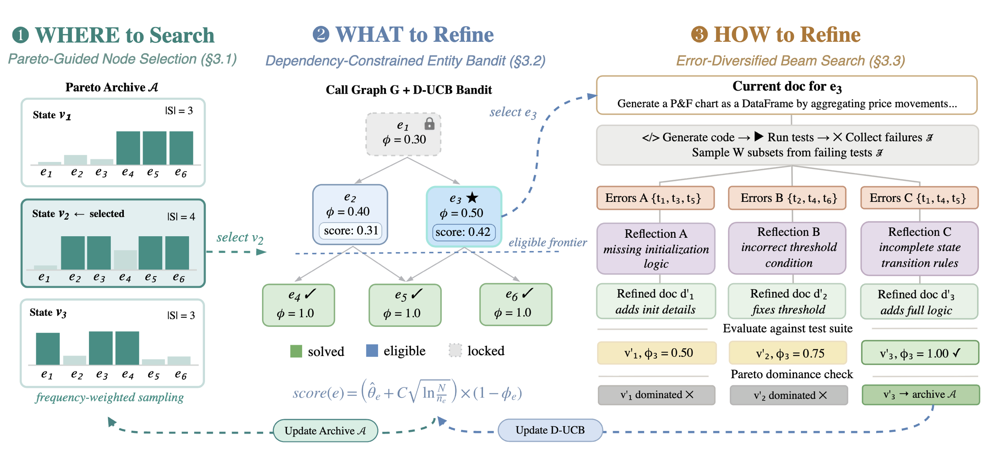

<p align="center">
  
</p>

<p align="center">
  <b>Multi-frontier tree search for agent-oriented code documentation</b> —
  refines a natural-language specification of a Python module under which an
  LLM can re-generate code that maximally passes the module's tests.
</p>

<p align="center">
  <a href="LICENSE"></a>
</p>

## What is SpecForge

SpecForge is a documentation-optimization framework for module-level code generation. Given a Python module, SpecForge searches for a natural-language documentation under which an LLM can re-generate code that maximally passes the module's tests. The optimized documentation is itself the artifact: it serves as a behavioral interface between the source code and any downstream code-generation model.

## How it works

SpecForge frames documentation refinement as a tree search over candidate documentation states, organized along three axes — **where** to continue, **what** to refine next, and **how** to refine.

<p align="center">
  
</p>

1. From the source module, an initial documentation is drafted and a set of test cases is synthesized to provide a feedback signal.
2. At each iteration, the search picks a documentation state from a Pareto archive (**where**), selects an entity to refine via a dependency-constrained bandit (**what**), and generates one or more refined children by partitioning the failing tests into distinct error subsets (**how**).
3. Each child is evaluated by regenerating code from the refined documentation and running the tests; surviving children enter the archive if they are not Pareto-dominated.
4. When the search budget is exhausted, the documentation that yields the highest test pass rate is returned, together with the regenerated code and its evaluation against the module's ground-truth tests.

## Installation

```bash
pip install -r requirements.txt
export OPENAI_API_KEY=sk-...
```

For Claude or Gemini backbones, also set `ANTHROPIC_API_KEY` or `GOOGLE_API_KEY`.

## Usage

A run consists of two stages.

### Stage 1 — Coverage-driven test synthesis

For each entity in the module, the LLM proposes test cases from the entity signature and reference implementation, then iteratively augments the suite until per-entity line and branch coverage exceed configurable thresholds. Every generated test is executed against the reference and discarded if it fails, so the surviving suite is correct by construction.

```bash
python scripts/generate_llm_tests.py \
    --module data/deveval_plus/stocktrends/indicators.py \
    --model gpt-4o \
    --branch-coverage 0.90
```

| Flag | Default | Meaning |
|---|---|---|
| `--branch-coverage` | `0.90` | Per-entity branch-coverage target |
| `--max-iterations` | `5`    | Cap on coverage-driven generation rounds per entity |
| `--all` | — | Generate for every module in the benchmark in one pass |

The validated suite lands in `data/deveval_plus/<module>/tests-<stem>-llm/` and feeds Stage 2.

### Stage 2 — SpecForge search

```bash
python scripts/run_specforge.py \
    --module data/deveval_plus/stocktrends/indicators.py \
    --model gpt-4o \
    --output-dir artifacts/quickstart
```

`--model` selects the LLM backbone — any of `qwen3-235b-a22b-instruct-2507`, `gemini-2.5-flash`, `gpt-4o`, `gemini-3.1-pro-preview`, `claude-sonnet-4-5`. Defaults for every search knob live in `configs/default.yaml` and can be overridden per-flag.

| Flag | Default | Meaning |
|---|---|---|
| `--budget` | `50` | LLM-call budget *B* per module |
| `--width` | `3` | Width *W* — number of error-diversified children expanded per node |
| `--temperature` | `0.7` | Sampling temperature for the refinement LLM (code-gen is fixed at 0.2) |
| `--seed` | `42` | RNG seed for reproducible runs |

Internally the entity bandit uses a Discounted UCB (γ = 0.95, ~20-step effective window) to pick which entity to refine at each iteration; the bandit and the Pareto archive can be ablated independently via `--no-bandit` / `--no-pareto-archive`.

### Outputs

After Stage 2 the run directory contains:

| File | Contents |
|---|---|
| `result.json` | Headline numbers: pass rate on ground-truth tests, total nodes, total LLM tokens |
| `summary.json` | Per-entity pass rates over the search trajectory |
| `nodes/<id>/` | The refined documentation, the regenerated code, the test errors, and the hypothesis at every node visited |

## Downstream utility

The SpecForge documentation produced by Stage 2 is a behavioral spec, so it can be plugged into any downstream code-generation pipeline. We report its utility on two independent tasks below; each task accepts a module-level documentation as one of its input configurations, but does not require that documentation to come from SpecForge — RepoAgent docs, hand-written specs, or any other module-level documentation work as drop-in inputs.

### Cross-language translation (Python → Java)

For each module under `data/deveval_plus_java/`, an LLM is prompted to translate a Python module into Java, then the generated Java is compiled and tested against the JUnit 5 harness shipped with the module. Three input configurations are supported — pick one per invocation:

```bash
# Setup 1 — source only:  prompt the LLM with just the Python source
python scripts/run_crosslang.py \
    --module stocktrends \
    --configs source_only \
    --model gpt-4o \
    --output-dir artifacts/crosslang

# Setup 2 — doc only:  prompt with a module-level documentation;
python scripts/run_crosslang.py \
    --module stocktrends \
    --configs doc_only \
    --doc-dir path/to/your/module_doc.md \
    --model gpt-4o \
    --output-dir artifacts/crosslang

# Setup 3 — doc + source:  prompt with both; 
python scripts/run_crosslang.py \
    --module stocktrends \
    --configs doc_source \
    --doc-dir path/to/your/module_doc.md \
    --model gpt-4o \
    --output-dir artifacts/crosslang

# Evaluated on test files
python scripts/eval_crosslang.py \
    --module stocktrends \
    --gen-dir artifacts/crosslang \
    --output-dir artifacts/crosslang_eval
```

#### Available Arguments
<details>
<summary>Click here to see available arguments</summary>

| Argument | Description | Default |
|----------|-------------|---------|
| `--module` | Module name under `data/deveval_plus_java/` (e.g. `stocktrends`, `lice`) | Required (or pass `--all`) |
| `--all` | Sweep every module found in `data/deveval_plus_java/` | False |
| `--configs` | One or more of `source_only`, `doc_only`, `doc_source` | `source_only doc_only doc_source` |
| `--doc-dir` | Path to a module-level documentation (a `.md` file, or a Stage-2 run directory containing a `doc.md`); the doc may come from any source — SpecForge, RepoAgent, hand-written, etc. | Required when `--configs` includes `doc_only` or `doc_source` |
| `--model` | LLM backbone for translation (any model accepted by Stage 2) | `gpt-4o` |
| `--output-dir` | Where generated Java files and per-config logs are written | `artifacts/crosslang_<model>_<timestamp>` |
| `--dry-run` | Build prompts and write them to disk without calling the LLM | False |
| `--mvn-bin` | Path to the Maven binary used by `eval_crosslang.py` (`mvn test` against the per-module `pom.xml`) | `mvn` |
| `--gen-dir` | Directory of `<config>.java` files produced by `run_crosslang.py` (consumed by `eval_crosslang.py`) | Required for `eval_crosslang.py` |
| `--timeout` | Per-module Maven timeout in seconds (`eval_crosslang.py`) | 180 |

</details>

### New-feature implementation (SWE-Dev)

For one PRD in `data/swedev_selected/<pkg>/prds/{easy,hard}/`, an LLM is prompted to implement the requested feature in a single `main.py`, which is then executed against the corresponding test in `<pkg>/tests/`. Two input setups are supported, selected implicitly by whether `--docs-dir` is passed:

```bash
# Setup 1 — PRD + reference source:  SWE-Dev's default setup.
python scripts/run_swedev.py \
    --prd data/swedev_selected/vulture/prds/easy/test_conditions-level1.md \
    --model gpt-4o \
    --output-dir artifacts/swedev_eval/setup1

# Setup 2 — doc + reference source.
python scripts/run_swedev.py \
    --prd data/swedev_selected/vulture/prds/easy/test_conditions-level1.md \
    --docs-dir path/to/your/per_package_docs/ \
    --model gpt-4o \
    --output-dir artifacts/swedev_eval/setup2

# Evaluated on test files
python scripts/aggregate_swedev.py \
    --runs-dir artifacts/swedev_eval \
    --out artifacts/swedev_summary.json
```

#### Available Arguments
<details>
<summary>Click here to see available arguments</summary>

| Argument | Description | Default |
|----------|-------------|---------|
| `--prd` | Path to a single PRD `.md` file under `data/swedev_selected/<pkg>/prds/{easy,hard}/` | Required (or pass `--all`) |
| `--all` | Run every PRD found under `data/swedev_selected/*/prds/{easy,hard}/` | False |
| `--docs-dir` | Directory of per-package module-level docs (one `<pkg>.md` or one `<pkg>/*.md` per package); the docs may come from any source — SpecForge, RepoAgent, hand-written, etc. **Omit to run Setup 1 (SWE-Dev default); pass to run Setup 2.** | Omitted ⇒ Setup 1 |
| `--num-workers` | Parallel pytest workers (only meaningful with `--all`) | 4 |
| `--timeout` | Per-instance pytest timeout in seconds | 120 |
| `--model` | LLM backbone for code generation | `gpt-4o` |
| `--temperature` | Sampling temperature for the code-generation LLM | 0.2 |
| `--resume` | Skip instances whose `result.json` already exists (`--all` only) | False |
| `--dry-run` | Build prompts and write them to disk without calling the LLM | False |
| `--output-dir` | Per-instance run directories — generated `main.py`, captured pytest output, headline `result.json` | `artifacts/swedev_eval` |
| `--runs-dir` | Directory of per-instance results consumed by `aggregate_swedev.py` | Required for `aggregate_swedev.py` |
| `--out` | Where `aggregate_swedev.py` writes the aggregated summary JSON | `artifacts/swedev_summary.json` |

</details>

## Benchmark

`data/deveval_plus/` contains the 20 Python modules used in the paper, sourced from DevEval and from open-source GitHub repositories. Each module ships with its source file, its ground-truth test suite, and a `meta.json` with provenance.

Two additional datasets support the downstream experiments above:

- `data/deveval_plus_java/` — 16 Java test harnesses (Maven projects) for the **cross-language translation** task. Each module's `src/test/java/` contains JUnit 5 tests that mirror the Python ground-truth, and `api_stub.java` defines the API surface the generated Java code must satisfy.
- `data/swedev_selected/` — 10 Python packages and 27 PRD instances (15 easy + 12 hard) for the **new-feature implementation** task. For each package, `tests/` contains the test suite executed against the LLM-generated `main.py`, and `prds/{easy,hard}/` contains the per-instance PRDs.

## Citation

If you use SpecForge in your research, please cite our NeurIPS 2026 paper:

```bibtex
@inproceedings{cheng2026specforge,
  title     = {SpecForge: Agent-Oriented Code Documentation Optimization via Multi-Frontier Tree Search},
  author    = {Cheng, Yutong and Chen, Haifeng and Gao, Peng and Cheng, Wei},
  booktitle = {Advances in Neural Information Processing Systems (NeurIPS)},
  year      = {2026}
}
```

## License

MIT (see `LICENSE`). Each benchmark module retains its original license;
